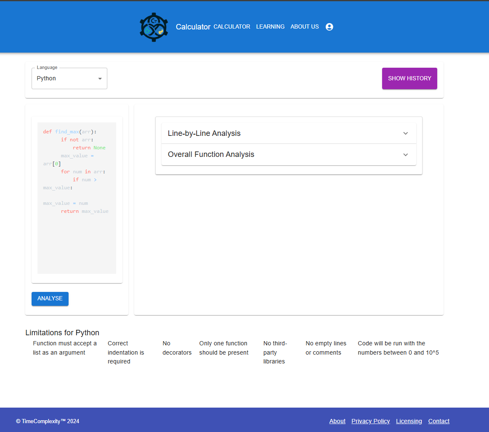
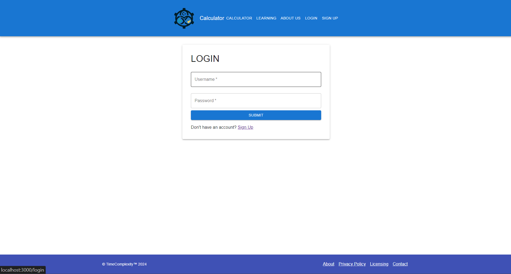
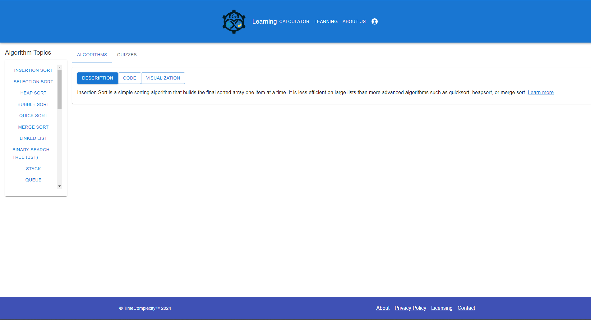

# Time Complexity Analyzer

## Overview
The **Time Complexity Analyzer** is a powerful tool for code profiling, designed to measure runtime and provide insights into the performance of functions. While the tool approximates the time complexity of functions, its accuracy is limited due to the inherent challenges of data fitting and model simplification.

---

## Key Features
### 1. Code Profiling and Runtime Analysis
- **Precise Runtime Measurement**:
  - Tracks execution time for each line of code.
  - Provides the total runtime of functions.
- **Profiling Features**:
  - Outputs detailed runtime logs for in-depth performance evaluation.
  - Highlights performance bottlenecks in functions.

### 2. Time Complexity Approximation
- Approximates the time complexity of functions using fitted mathematical models.
- **Limitations**:
  - The approximations may not always reflect the actual complexity, especially for functions with edge cases or unusual input distributions.
  - Relies on data fitting, which introduces inaccuracies for complex or nonstandard patterns.

### 3. Algorithm Database
- A repository of algorithms with:
  - Definitions and code examples.
  - Instructional videos and quizzes to support learning.

### 4. User Authentication
- Secure sign-up and login to provide personalized access to profiling data and analysis reports.

---

## How Runtime is Calculated
- The tool uses **instrumentation** to insert profiling hooks into the code.
- For each line or function:
  - Start and end timestamps are recorded.
  - The difference between these timestamps gives the execution time.
- Outputs include:
  - Execution time for each individual line of code.
  - Total runtime for the entire function.

---

## How Time Complexity is Approximated
### Least Squares Method
The tool applies the "least squares method" to fit runtime data to known mathematical models. Here’s how it works:

1. Collect Data:
   - The runtime for various input sizes (x_data) and corresponding execution times (y_data) are recorded.

2. Error Function:
   - The error between the observed execution times and the model predictions is minimized.
   - For a given model f(x, params), the error function is:
       Error = Σ [y_i - f(x_i, params)]^2

3. Optimization:
   - Numerical optimization techniques (e.g., least_squares from scipy.optimize) are used to adjust the parameters of the model until the error is minimized.

4. Model Selection:
   - The tool evaluates multiple models (e.g., linear, logarithmic, quadratic) and selects the one with the lowest residual sum of squares (RSS).
   - Overly complex models are penalized to avoid overfitting.

---

## Screenshots

### Main Page

### Code Output

### History

### Login/Sign Up

### Learning Page

---

## Limitations
1. **Accuracy of Time Complexity Approximation**:
   - Limited by the quality of data fitting and the assumptions made by the mathematical models.
   - Small coefficients or inappropriate constants can lead to misleading results.
2. **Single-Array Functions**:
   - Only supports functions with a single array as input.
3. **External Calls**:
   - Cannot measure execution time for functions that rely on external calls.

---

## Areas for Improvement
- **Better Runtime Modeling**:
  - Explore advanced optimization methods like robust regression or Bayesian optimization for improved fitting accuracy.
- **Enhanced Profiling**:
  - Add support for functions with multiple input types and external calls.
- **Sophisticated Input Handling**:
  - Improve input generation methods to better reflect real-world scenarios.

---
